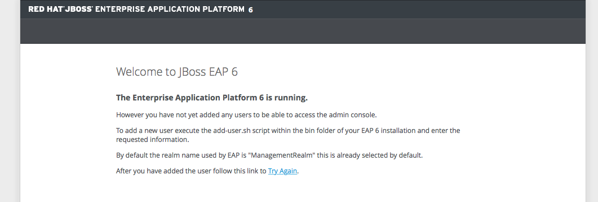

== Exercise 1 - Docker Basics

NOTE: This is a beginner exercise.

=== What you will learn
Particpants will learn how to to start developing Red Hat Enterprise Linux based containers.

Participants will also learn how to use the Docker CLI to manage containers in a development environment.

[TIP]
====
You can clone the sources by running:
----
$ git clone http://classroom.example.com:5002/docker-jboss-eap.git ~/docker-jboss-eap
----
All of the files you are asked to create in this tutorial are then located in ~/docker-jboss-eap/lab 
====

=== Get familar with Docker CLI
In this section you will learn the basic commands of the docker CLI so that you can manage and build containers

Step 1 - Start an interactive container::
The command for starting a container is `docker run` and it has a couple of important options. below are the most important options:
+
-i or --interactive=true::: Will start the container with an interactive terminal so that we can open even if we disconnect
-t::: Tells the run cammnd to allocate a pseudo TTY session
-d or --detach=true::: Detached mode: run the container in the background and print the new container ID. This option can not be combined with `-i` or `-t`.
-P or --publish-all=true::: Publish all exposed ports to random ports on the host interfaces
-p or --publish=[]::: Publish a container's port to the host
-e, --env=[]::: Set environment variables
--env-file=[]::: Read in a line delimited file of environment variables
+
::
For more information on available options for the `run` command type `docker run --help` in a terminal.
+
Start a clean Red Hat Enterprise Linux (RHEL) 7.1 container like this:
+
[source,numbered]
----
$ docker run -it rhel7.1 bash
Unable to find image 'rhel7.1:latest' locally
Pulling repository classroom.example.com:5000/rhel7.1
10acc31def5d: Download complete
Status: Downloaded newer image for classroom.example.com:5000/rhel7.1:latest
[root@d67ea0f4a238 /]#
----
+
NOTE: The output from the docker run command may differ and your hostname will differ from the example above
+
Congratulations! you have succesfully started a container using Red Hat Enterprise Linux. This container has it's own file system, own process tree, own IP address and it's own hostname. Let's investigate a bit closer:
+
[source,numbered]
----
$ uname -a
Linux d67ea0f4a238 3.10.0-229.el7.x86_64 #1 SMP Thu Jan 29 18:37:38 EST 2015 x86_64 x86_64 x86_64 GNU/Linux
$ cat /etc/redhat-release
Red Hat Enterprise Linux Server release 7.1 (Maipo)
----
+
The RHEL container is purposefully kept very minimal, the idea is that each service based on a container will define and install it's own dependencies. Tools like ps (used to list running processes) is not installed in the RHEL container, but can easily be installed using `yum`.
+
IMPORTANT: Installing packages and changing configurations using the interactive console is strongly discouraged, since maintaining containers that require manual setup is much harder than maintaining containers that are automated.
+
Using the commands above we have started a bash shell in a container. From the prompt we can see that it is using a different hostname from your desktop. From `uname -a` and `cat /etc/redhat-release` we can see that it's a Red Hat Enterprise Linux Server release 7.1 and that is regardless of what desktop operating environment you are running. Additionally the container isolated from your host and will have separate process tree, network, storage etc. So testing application in container will not be affected by which binary you have installed on the Desktop.
+
Stop the container by either pressing CTRL-D or by typing exit in the container prompt.
+
 [root@d67ea0f4a238 /]# exit
+
TIP: The container that we stopped are not deleted. Using `docker ps -a` you can see the container and using `docker start -a <container-id>` you can start an reconnect to the container.

Step 2 - Start a daemon container::
Often it's more useful to start a container as a daemon process. For example when a container is built to provide a service, like an application server or a database.
+
Red Hat ships a pre-built docker image using JBoss EAP 6.4, you can run the following to start JBoss EAP 6.4 as a daemon process:
+
[source,numbered]
----
$ docker run -d -p 9080:8080 jboss-eap-6/eap:6.4
3e336d31ce25cab777cf8ffd9c8779fbe0751455fa1e9c80cb30be69810ab8ae
$ docker ps
CONTAINER ID  IMAGE                 COMMAND                CREATED             STATUS              PORTS                     NAMES
3e336d31ce25  jboss-eap-6/eap:6.4   "/opt/eap/bin/standa"  16 seconds ago      Up 14 seconds       0.0.0.0:9080->8080/tcp   pensive_euclid
----
+
The container running JBoss EAP is started and port 8080 in the container is mapped to 9080 on your host. Verify that the server responds by opening a browser to <http://localhost:9080>.
+
NOTE: As well as manually mapping containers, you can use the -P option to automically map all exposed ports to an available port on the host (e.g. for JBoss EAP 8080).
+
The browser should now show the JBoss EAP Welcome Page when.
+
image::images/jboss-eap-welcome.png["JBoss EAP Welcome Page"]

Step 3 - List, stop and delete containers::
When starting containers in daemon mode they are running in the background until the main process of the container stops or until someone manually stops its. Let's stop the JBoss EAP container that we started in Step2.
+
[source,numbered]
----
$ docker ps
CONTAINER ID  IMAGE                 COMMAND                CREATED             STATUS              PORTS                     NAMES
3e336d31ce25  jboss-eap-6/eap:6.4   "/opt/eap/bin/standa"  16 seconds ago      Up 14 seconds       0.0.0.0:9080->8080/tcp    pensive_euclid
$ docker stop <container-id>
3e336d31ce25
----
+
Let's start a a couple of containers:
+
[source,numbered]
----
$ for x in {0..9}; do docker run -d --name="container-$x" rhel7.1 sleep 30; done
e17a6426595b9daa91fda4573ecd7a58b1949e3343cd2b90db4720baf33e0afc
4c97f6461d8eafd360c4d9f139584e1fcf9f56099b049eb6f0b6efa759a0217b
8a70ba2679717bbacb565520ee1f17ebcd65112288a5f0f1901bd2c931ad9b2a
fe32249ffb31cb3189dcc9581cb0958358fb8a466c84d0e4caed79514f348b59
03e14b9e6e7e3b525aba46e5c2da32a0388c1f03568253f806bd24a46c538a21
e55c1beaf565085b8221ca0192df7a1f9791419673876a0695d1d68cccbd09e0
a5a1c45cbeb3222e154c58bef975508757f50da55d6d8e0347ffa848d9ec3ffd
b001c6cf360b56eee532b3931a67465c6e203dac889ad1e905afc9648c9d7140
2d185826f86644996a553b22576c55a536b70720da6576cdf4d53529b6c08a1c
6637273d947043d3cd7f5c777fd668b5746c6d08699bbd907f70c1eca1424918
----
+
Within 30 sec run `docker ps` to list the containers:
+
[source,numbered]
----
$ docker ps
CONTAINER ID        IMAGE                                       COMMAND             CREATED             STATUS              PORTS               NAMES
6637273d9470        classroom.example.com:5000/rhel7.1:latest   "sleep 30"         5 seconds ago       Up 4 seconds                            container-9
2d185826f866        classroom.example.com:5000/rhel7.1:latest   "sleep 30"         6 seconds ago       Up 5 seconds                            container-8
b001c6cf360b        classroom.example.com:5000/rhel7.1:latest   "sleep 30"         8 seconds ago       Up 6 seconds                            container-7
a5a1c45cbeb3        classroom.example.com:5000/rhel7.1:latest   "sleep 30"         9 seconds ago       Up 7 seconds                            container-6
e55c1beaf565        classroom.example.com:5000/rhel7.1:latest   "sleep 30"         10 seconds ago      Up 8 seconds                            container-5
03e14b9e6e7e        classroom.example.com:5000/rhel7.1:latest   "sleep 30"         11 seconds ago      Up 9 seconds                            container-4
fe32249ffb31        classroom.example.com:5000/rhel7.1:latest   "sleep 30"         12 seconds ago      Up 10 seconds                           container-3
8a70ba267971        classroom.example.com:5000/rhel7.1:latest   "sleep 30"         13 seconds ago      Up 12 seconds                           container-2
4c97f6461d8e        classroom.example.com:5000/rhel7.1:latest   "sleep 30"         14 seconds ago      Up 13 seconds                           container-1
e17a6426595b        classroom.example.com:5000/rhel7.1:latest   "sleep 30"         15 seconds ago      Up 14 seconds                           container-0
----
+
Wait 30 sec and then run `docker ps` again. This time no containers should be displayed. Now run `docker ps -a` and you should see the containers, but this time with STATUS Exited.
+
TIP: To remove the all the containers and free up the storage it's using excute the following command `docker rm $(docker ps -aq)`.

Step 4 - Override the command::
A container typically has a default command, for example the `jboss-eap-6/eap:6.4` container has a default command that looks like this `/opt/eap/bin/standalone.sh -b 0.0.0.0`. To override that command to for example to enable access to the administration console one have to add the option `-bmanagement 0.0.0.0`. This could look like this.
+
[source,numbered]
----
$ docker run -d -p 9990:9990 jboss-eap-6/eap:6.4 /opt/eap/bin/standalone.sh -b 0.0.0.0 -bmanagement 0.0.0.0
----
+
Now open a browser to link:http://localhost:9990[]; as we which haven't added a admin user yet it should give you the following error page:
+

Step 5 - Executing commands in a running container::
We can execute commands directly to a running container using the `docker exec` command. To for example add a user one can run the following command:
+
[source,numbered]
----
$ docker exec <container-id_or_name> /opt/eap/bin/add-user.sh -g admin -u admin -p admin-123 -s
----
+
Go back to the browser and click on the "Try Again" link. User username: admin and password: admin-123 to authenticate to the admin console and you should now see the admin console.
+
TIP: Use the following command to get shell access to a running contianer `docker exec -it <container-id> bash`. This will open bash shell in the running container so that you can check log files, investigate file permissions etc.
+
Stop the JBoss EAP container using `docker stop <container-id>`.

Step 6 - Customize a container::
All the commands in the previous steps are useful to know and great for development etc, but in a production environment you will most likely have a orchestration layer to manage start, stop, etc of containers. The build model of Docker allows us to extend existing containers and build our own customized versions. The benefits of building customized containers are:
+
* Standardization of:
** Tools
** 3rd party libraries
** Monitoring
* Versioning of containers
* Patching of containers
+
::
+
Customization is done in a text file called a "Dockerfile". It contains a set of instructions on how to build an image. 
Create a new directory `lab` and change in to it:
+
----
$ mkdir -p lab
$ cd lab
----
+
TIP: If you are in a Red Hat classroom, then we have installed the Atom editor for you. To edit a file run `atom <filename>` on the command line.
+
Create a new file called `Dockerfile` with the following content:
+
[source,Dockerfile]
----
FROM jboss-eap-6/eap:6.4  #<1>

RUN $JBOSS_HOME/bin/add-user.sh -g admin -u admin -p admin-123 -s #<2>

CMD $JBOSS_HOME/bin/standalone.sh -b 0.0.0.0 -bmanagement 0.0.0.0 #<3>

EXPOSE 8080 9990 9999 #<4>
----
+
<1> Extend the JBoss EAP image that Red Hat provides
<2> Add and admin user to the container
<3> Override the start command to enable remote API
<4> Expose the Web, Admin Web and Remote Admin API ports.
+
Now, build the image:
+
[source]
----
$ docker build -t <your-alias>/jboss-eap:1.0 .
----
+
----
$ docker images
REPOSITORY                                   TAG                 IMAGE ID            CREATED             VIRTUAL SIZE
tqvarnst/jboss-eap                           1.0                 db4848085173        44 seconds ago      530.6 MB
classroom.example.com:5000/jboss-eap-6/eap   6.4                 7a89f0810450        12 days ago         530.6 MB
classroom.example.com:5000/rhel7.1           latest              10acc31def5d        3 months ago        154.1 MB
----
+
Now we have built our customized version of JBoss EAP container we can more easily start a JBoss EAP container that has our desired configuration.
+
[source]
----
$ docker run -it -p 9080:8080 -p 9990:9990 -p 9999:9999 <your-alias>/jboss-eap:1.0
----
+
Try login in to the administation control by access <http://localhost:9990> using `admin` as the username and `admin-123` as the password.
+
Stop the container using `CTRL-C`

Step 7 - Environment variables::
+
Building images that are customized is great, but sometimes you also need to provide information to the container when you run it. For example the container that Red Hat provides for JBoss EAP uses 1.3 GB of memory. This might be a bit much in a development environment and too low in a production environment. We can alter this by passing environment variables to the container that override the defaults.
+
Create a file called `jboss-dev.env`:
+
----
JAVA_OPTS=-client -XX:+TieredCompilation -XX:TieredStopAtLevel=1 -Xverify:none -Xms64m -Xmx256m -Dorg.apache.tomcat.util.LOW_MEMORY=true -XX:+UseCompressedOops -XX:+AggressiveOpts -XX:+DisableExplicitGC -Djava.net.preferIPv4Stack=true
PRESERVE_JAVA_OPTS=true
----
+
Start the container like this:
+
[source]
----
$ docker run -it -p 9990:9990 --env-file=jboss-dev.env <your-alias>/jboss-eap:1.0
----
+
Investigate the terminal output and compare the values of -Xms and -Xmx.
+
Stop the container using `CTRL-C`

=== Clean up and prepare for next exercise
Before we move on to the next exercise the participant should stop any running containers and remove any stopped containers:

[source,bash]
----
$ docker rm -f $(docker ps -aq)
----

=== Summary

After this exercise the participant should feel comfortable with starting, stopping and managing containers. The participant should be able to access a running container to check it's state, also should have a basic understanding of networking (mapping ports etc). Further more the participant should have gained an elementary knowledge on how to create custom images.

