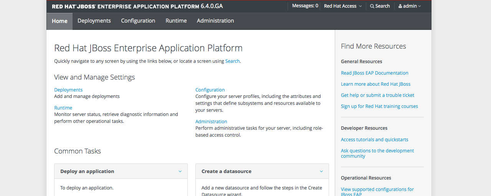
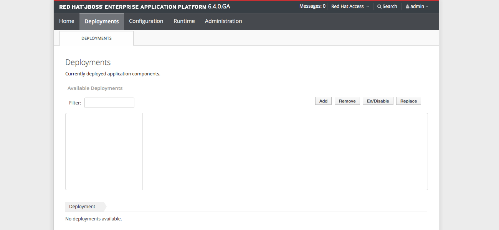
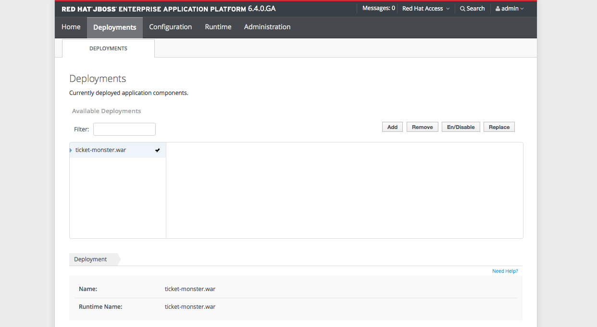
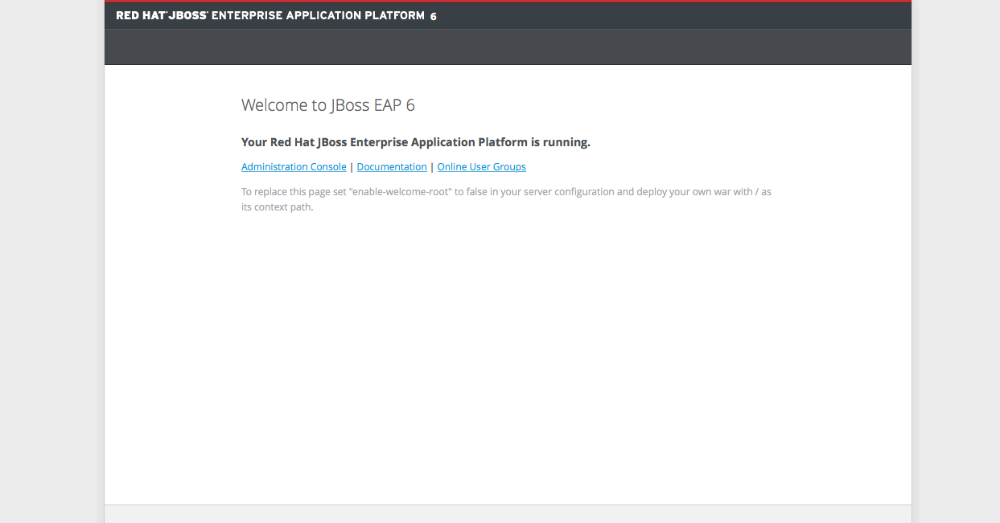

# Exercise 2

Java EE Development with Docker containers

## What you will learn
Particpants will learn how to use combine Java EE Development with maven and nexus together with Docker containers. Participants will also learn how to use the Arquillian for testing in running containers.

## Prerequisites

* Participants should successfully have executed exercise 1
* Participatns should have cleaned up any running containers

NOTE: To clean up all the running container run the following command `docker stop $(docker ps -q) && docker rm $(docker ps -aq)`.

### Compiling and deploying the project
These steps are all done on the particpants desktop.

Step 1 - Clone the project from the instructor git::
The instructor has a GIT repository running on classroom.example.com.
+
[source,shell,numbered]
----
$ cd $HOME
$ git clone http://classroom.example.com:5002/ticket-monster.git
$ cd ticket-monster
----

Step 2 - Build the application::
+
[source,shell,numbered]
----
$ mkdir -p ~/.m2
$ cp settings.xml ~/.m2
$ mvn clean package
----
+
Make sure that everything build correctly.

Step 3 - Start the customized jboss eap container::
This step requires that the custom-jboss-eap container was built as part of exercise 1.
+
[source,shell]
----
$ docker run -i -p 9080:8080 -p 9990:9990 -p 9999:9999 <your-alias>/jboss-eap:1.0
----

Step 4 - Verify access to the administration portal::
Open a browser and go to http://localhost:9990 and login with username: `admin` and password: `admin-123`.
+

+
Check that no applications are deployed by clicking on the `Deployments` tab
+

Step 5 - Deploy an application from command line::
+
[source,shell]
----
$ mvn clean package jboss-as:deploy
----
+
NOTE: You will be promoted for a username and password. Use the same credential as in step 4.
+
Check the administration console again (might need to reload the page)
+

+
Verify that the application is deploy and working by opening a browser to http://localhost:9080/ticket-monster
+

As we have seen in this steps it's we can use the containerized application almost as it was running directly on our desktop.

### Testing applications with Arquillian

Step 1 - Run Arquillian tests::
+
[source,shell]
----
$ mvn clean package -Parq-jbossas-remote
----
+
The test report should look like this:
+
[source,shell]
----
-------------------------------------------------------
 T E S T S
-------------------------------------------------------
Running org.jboss.examples.ticketmonster.test.rest.BookingServiceTest
Tests run: 4, Failures: 0, Errors: 0, Skipped: 1, Time elapsed: 4.956 sec
Running org.jboss.examples.ticketmonster.test.rest.EventServiceTest
Tests run: 4, Failures: 0, Errors: 0, Skipped: 0, Time elapsed: 2.815 sec
Running org.jboss.examples.ticketmonster.test.rest.ShowServiceTest
Tests run: 5, Failures: 0, Errors: 0, Skipped: 0, Time elapsed: 2.268 sec
Running org.jboss.examples.ticketmonster.test.rest.VenueServiceTest
Tests run: 2, Failures: 0, Errors: 0, Skipped: 0, Time elapsed: 2.11 sec

Results :

Tests run: 15, Failures: 0, Errors: 0, Skipped: 1
----
+
The arq-jbossas-remote profile enables Arquillian test which are, just like JUnit test, run as part of the build process in maven. However these arquillian tests are actually run inside JBoss EAP and can therefor for example use CDI injections.

Step 2 - Add a failing test::
Open `src/test/java/org/jboss/examples/ticketmonster/test/rest/ShowServiceTest.java` in a text editor and add the following test method to it:
+
[source,java]
----
    @Test
    public void failingTest() {
      List<Show> shows = showService.getAll(new MultivaluedHashMap<String,String>());
      assertNotNull(shows);
      assertEquals(10,shows.size());
    }
----
+
Run the test again, and this time it should **FAIL**.
+
[source,shell]
----
$ mvn clean package -Parq-jbossas-remote
----
+
Resulsts in :
+
[source,shell]
----
-------------------------------------------------------
 T E S T S
-------------------------------------------------------
Running org.jboss.examples.ticketmonster.test.rest.BookingServiceTest
Tests run: 4, Failures: 0, Errors: 0, Skipped: 1, Time elapsed: 5.254 sec
Running org.jboss.examples.ticketmonster.test.rest.EventServiceTest
Tests run: 4, Failures: 0, Errors: 0, Skipped: 0, Time elapsed: 1.795 sec
Running org.jboss.examples.ticketmonster.test.rest.ShowServiceTest
Tests run: 6, Failures: 1, Errors: 0, Skipped: 0, Time elapsed: 2.569 sec <<< FAILURE!
failingTest(org.jboss.examples.ticketmonster.test.rest.ShowServiceTest)  Time elapsed: 0.044 sec  <<< FAILURE!
java.lang.AssertionError: expected:<10> but was:<6>
	at org.junit.Assert.fail(Assert.java:88)
	at org.junit.Assert.failNotEquals(Assert.java:743)
	at org.junit.Assert.assertEquals(Assert.java:118)
  ...
  ...
  ...
----
Step 2 - Correct the test::
+
Looking at the error message we can see that expected number of shows was 10, but actul result was 6. Let's change the expected result to 6 and run the tests again.
+
Open `src/test/java/org/jboss/examples/ticketmonster/test/rest/ShowServiceand change expected result to 6, like this:
+
[source,java]
----
    @Test
    public void failingTest() {
      List<Show> shows = showService.getAll(new MultivaluedHashMap<String,String>());
      assertNotNull(shows);
      assertEquals(6,shows.size());
    }
----
+
Run the test again to verify
+
[source,shell]
----
$ mvn clean package -Parq-jbossas-remote
----
+
This time we should have **SUCCESS**.

### Clean up and prepare for next exercise
Before we move on to the next exercise the participant should stop any running containers and remove any stopped containers. This can be done with two simple commands:

[source,shell]
----
$ docker stop $(docker ps -q)
$ docker rm $(docker ps -aq)
----

## Summary
After the second exercise participant should start to feel comfortable with manaing containers locally in a development environment. The most important benefit of running docker in a development environment like this is that the container can be almost identical with the target production environment. Lowering the complexity of Continious Delivery environment, and improving the quality.
